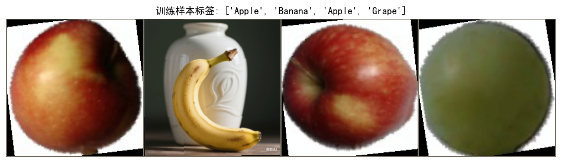
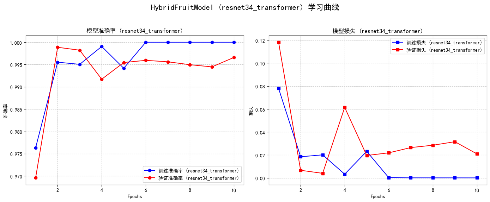
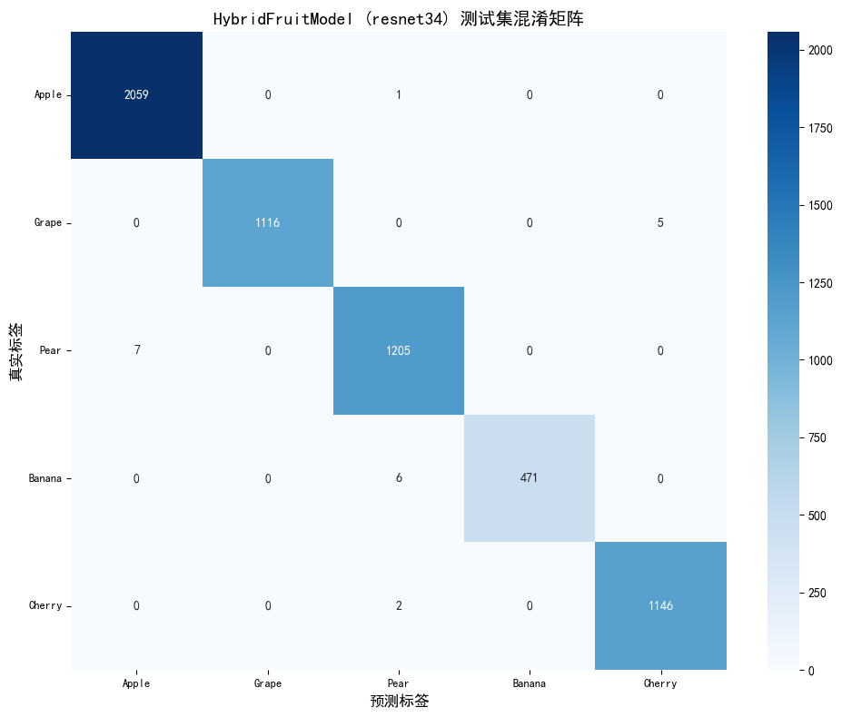
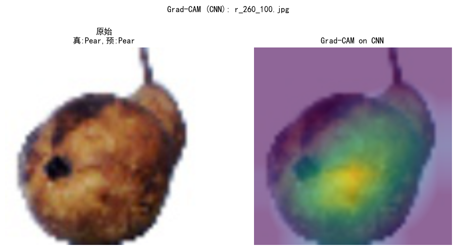
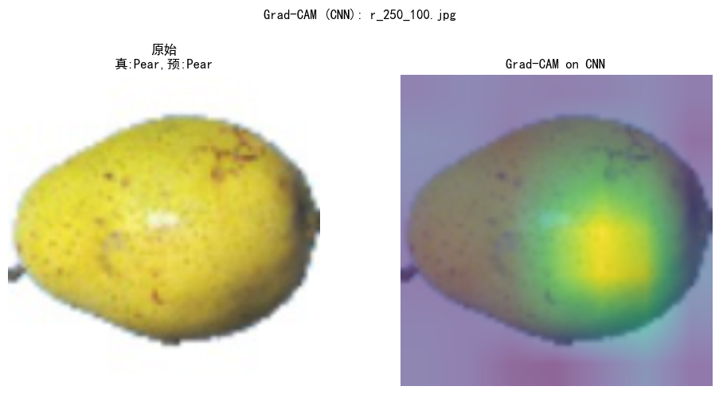
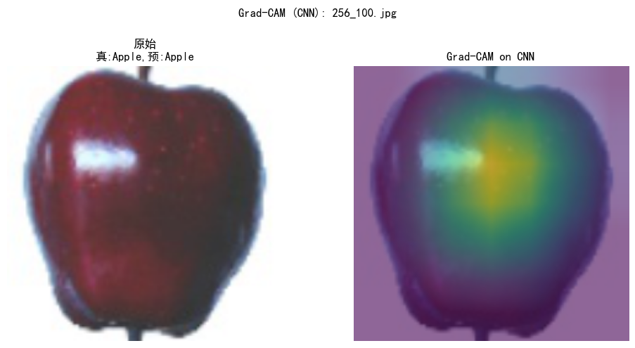
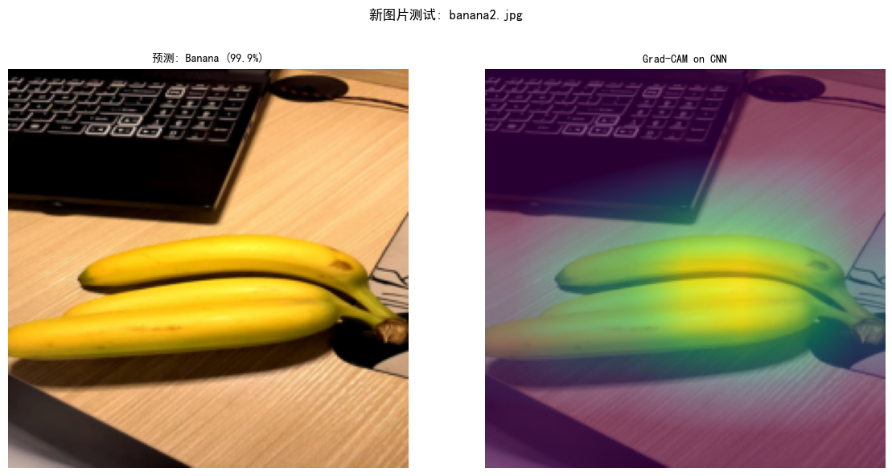
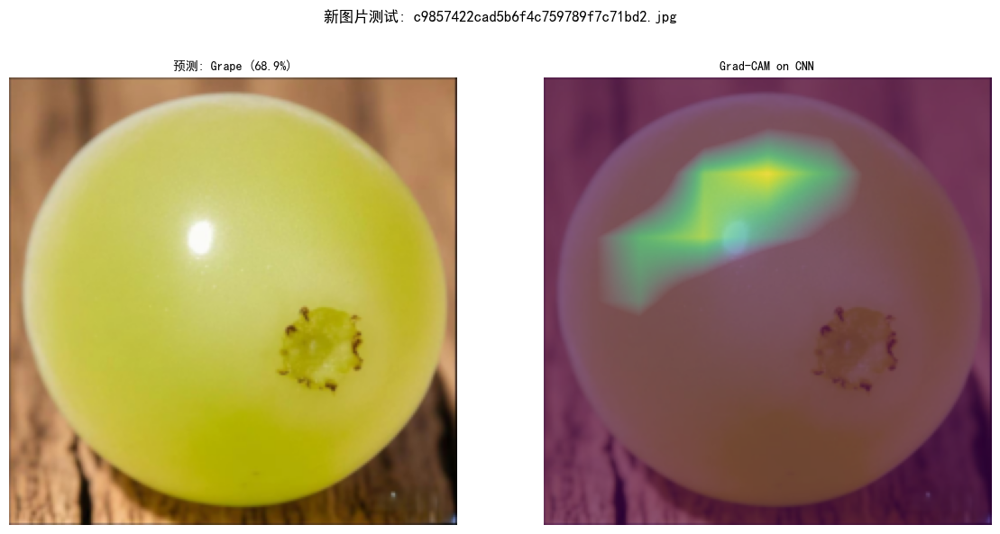
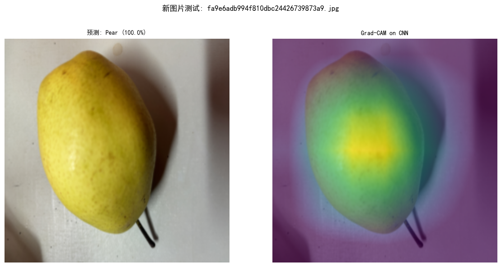
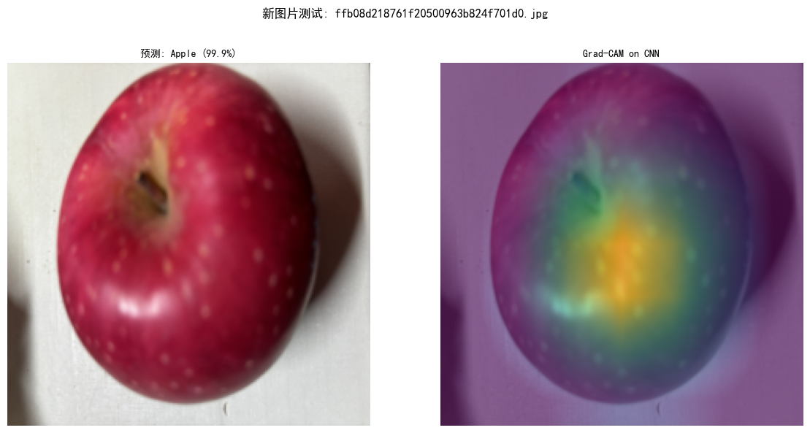

```python
# 步骤0: 设置与配置

# 1. 导入核心库
import torch
import torch.nn as nn
import torch.optim as optim
import torch.utils.data
import torchvision
from torchvision import datasets, transforms, models
import os
import numpy as np
import matplotlib.pyplot as plt
from PIL import Image, UnidentifiedImageError
import time # 用于计时
from tqdm import tqdm # 用于显示进度条
import json # 用于保存训练历史
import copy # 用于深拷贝模型权重

# 导入可选库 timm (用于加载CNN backbone)
import timm # PyTorch Image Models (包含 EfficientNet, ResNet 等)
print("timm 库已成功导入。")

# 导入可选库 captum (用于模型可解释性，如Grad-CAM)
captum = None
LayerGradCam = None
LayerAttribution = None
captum_available = False
try:
    from captum.attr import LayerGradCam, LayerAttribution
    import captum
    print("captum 库及其 LayerGradCam, LayerAttribution 已成功导入。")
    captum_available = True
except ImportError:
    print("警告: captum 库未安装或无法导入。Grad-CAM 等可解释性方法将不可用。")


# 2. 定义常量和超参数

# 自动检测设备 (GPU 或 CPU)
DEVICE = torch.device("cuda" if torch.cuda.is_available() else "cpu")
print(f"使用的设备: {DEVICE}")

# 数据集根目录 (请根据您的实际文件结构调整)
DATA_DIR = './2021_fruits_dataset/'

# 训练集、验证集、测试集路径
TRAIN_DIR = os.path.join(DATA_DIR, '1training')
VAL_DIR = os.path.join(DATA_DIR, '2validation')
TEST_DIR = os.path.join(DATA_DIR, '3test')

# 检查路径是否存在
print(f"\n检查数据集路径:")
for dir_path, dir_name in zip([DATA_DIR, TRAIN_DIR, VAL_DIR, TEST_DIR],
                              ["数据集根目录", "训练集目录", "验证集目录", "测试集目录"]):
    if os.path.exists(dir_path) and os.path.isdir(dir_path):
        print(f"  [信息] {dir_name} '{dir_path}' 存在。")
    else:
        print(f"  [警告/错误] {dir_name} '{dir_path}' 不存在或不是一个目录。请检查路径配置。")
        # 如果关键路径不存在，可能需要在此处停止脚本

# 图像处理和模型训练相关超参数
BATCH_SIZE = 32    # 批处理大小 (原B2CNN为64，可根据显存调整)
LEARNING_RATE = 1e-4 # 初始学习率
NUM_EPOCHS = 20      # 训练的总轮数 (原B2CNN为20，PureCNN为40)
IMAGE_SIZE = 224   # 模型期望的输入图像尺寸 (ResNet通常使用224x224)
NUM_CLASSES = 5    # 项目需要识别的水果类别数量

# 定义目标类别和映射 (来自B2CNN.pdf)
target_class_names = ['Apple', 'Grape', 'Pear', 'Banana', 'Cherry']
subfolder_map = {
    'Apple': ["Apple Braeburn", "Apple Crimson Snow", "Apple Golden 1", "Apple Golden 2", "Apple Golden 3", "Apple Granny Smith", "Apple Pink Lady", "Apple Red 1", "Apple Red 2", "Apple Red 3", "Apple Red Delicious", "Apple Red Yellow 1", "Apple Red Yellow 2"],
    'Grape': ["Grape Blue", "Grape Pink", "Grape White", "Grape White 2", "Grape White 3", "Grape White 4"],
    'Pear': ["Pear", "Pear Abate", "Pear Forelle", "Pear Kaiser", "Pear Monster", "Pear Red", "Pear Williams"],
    'Banana': ["Banana", "Banana Lady Finger", "Banana Red"],
    'Cherry': ["Cherry 1", "Cherry 2", "Cherry Rainier", "Cherry Wax Black", "Cherry Wax Red", "Cherry Wax Yellow"]
}
assert all(name in subfolder_map for name in target_class_names), "subfolder_map 字典中缺少某些 target_class_names 的映射, 请检查!"

class_to_idx = {name: i for i, name in enumerate(target_class_names)}
print(f"\n类别到索引的映射 (class_to_idx): {class_to_idx}")
idx_to_class = {i: name for name, i in class_to_idx.items()}
print(f"索引到类别的映射 (idx_to_class): {idx_to_class}")

# 定义 ImageNet 均值和标准差 (用于预训练模型)
imagenet_mean = [0.485, 0.456, 0.406]
imagenet_std = [0.229, 0.224, 0.225]
print(f"\nImageNet 均值 (imagenet_mean): {imagenet_mean}")
print(f"ImageNet 标准差 (imagenet_std): {imagenet_std}")

print("\n步骤 0: 设置与配置完成。")
```

    G:\Anaconda3\envs\DL_env2\lib\site-packages\tqdm\auto.py:21: TqdmWarning: IProgress not found. Please update jupyter and ipywidgets. See https://ipywidgets.readthedocs.io/en/stable/user_install.html
      from .autonotebook import tqdm as notebook_tqdm
    

    timm 库已成功导入。
    captum 库及其 LayerGradCam, LayerAttribution 已成功导入。
    使用的设备: cuda
    
    检查数据集路径:
      [信息] 数据集根目录 './2021_fruits_dataset/' 存在。
      [信息] 训练集目录 './2021_fruits_dataset/1training' 存在。
      [信息] 验证集目录 './2021_fruits_dataset/2validation' 存在。
      [信息] 测试集目录 './2021_fruits_dataset/3test' 存在。
    
    类别到索引的映射 (class_to_idx): {'Apple': 0, 'Grape': 1, 'Pear': 2, 'Banana': 3, 'Cherry': 4}
    索引到类别的映射 (idx_to_class): {0: 'Apple', 1: 'Grape', 2: 'Pear', 3: 'Banana', 4: 'Cherry'}
    
    ImageNet 均值 (imagenet_mean): [0.485, 0.456, 0.406]
    ImageNet 标准差 (imagenet_std): [0.229, 0.224, 0.225]
    
    步骤 0: 设置与配置完成。
    


```python
# 步骤1: 数据加载与预处理

from torch.utils.data import Dataset, DataLoader
# from PIL import Image, UnidentifiedImageError
# from tqdm import tqdm
# import matplotlib.pyplot as plt

# 设置 matplotlib 支持中文显示的字体
plt.rcParams['font.sans-serif'] = ['SimHei']
plt.rcParams['axes.unicode_minus'] = False

# 1. 定义数据变换 (Transforms) - 来自B2CNN.pdf，稍作调整
print("\n定义数据增强变换...")
train_transforms = transforms.Compose([
    transforms.Resize((IMAGE_SIZE, IMAGE_SIZE)), # 确保输入尺寸一致
    transforms.RandomHorizontalFlip(),
    transforms.RandomRotation(15),
    # transforms.ColorJitter(brightness=0.1, contrast=0.1, saturation=0.1, hue=0.1), # B2CNN中注释掉了，此处也保持
    transforms.ToTensor(),
    transforms.Normalize(mean=imagenet_mean, std=imagenet_std)
])

val_test_transforms = transforms.Compose([
    transforms.Resize((IMAGE_SIZE, IMAGE_SIZE)),
    transforms.ToTensor(),
    transforms.Normalize(mean=imagenet_mean, std=imagenet_std)
])
print("数据变换 (Transforms) 定义完成。")


# 2. 实现自定义 Dataset 类 (AggregatedFruitDataset) - 来自B2CNN.pdf的逻辑
class AggregatedFruitDataset(Dataset):
    """
    自定义数据集类, 用于从包含多个子类别的根目录加载水果图像,
    并将它们聚合成指定的主要类别。
    """
    def __init__(self, root_dir, subfolder_map, class_to_idx, transform=None, dataset_name="Dataset"):
        self.root_dir = root_dir
        self.subfolder_map = subfolder_map
        self.class_to_idx = class_to_idx
        self.transform = transform
        self.dataset_name = dataset_name
        self.samples = []
        self.class_sample_counts = {name: 0 for name in class_to_idx.keys()}

        print(f"\n开始初始化 {self.dataset_name}, 扫描目录: {self.root_dir} ...")
        start_time_init = time.time()

        if not os.path.isdir(root_dir):
            print(f"  [错误] {self.dataset_name} 的根目录 '{root_dir}' 不存在或不是一个目录。初始化失败。")
            return

        main_class_iterator = tqdm(self.subfolder_map.items(), desc=f"扫描 {self.dataset_name} 主类别", leave=False)
        for main_class, subfolders_list in main_class_iterator:
            if main_class not in self.class_to_idx:
                print(f"  [警告] ({self.dataset_name}): 主类别 '{main_class}' 在 subfolder_map 中, 但不在 class_to_idx 中, 将被忽略。")
                continue

            aggregated_label = self.class_to_idx[main_class]
            samples_found_for_this_main_class = 0
            for subfolder_name in subfolders_list:
                subfolder_path = os.path.join(self.root_dir, subfolder_name)
                if not os.path.isdir(subfolder_path):
                    continue
                
                for entry in os.scandir(subfolder_path): # scandir 比 listdir+join+isfile 更高效
                    if entry.is_file() and entry.name.lower().endswith(('.png', '.jpg', '.jpeg', '.bmp', '.gif')):
                        image_path = entry.path
                        self.samples.append((image_path, aggregated_label))
                        samples_found_for_this_main_class += 1
            
            self.class_sample_counts[main_class] += samples_found_for_this_main_class

        end_time_init = time.time()
        print(f"{self.dataset_name} 初始化完成, 耗时: {end_time_init - start_time_init:.2f} 秒。")
        print(f"  总共找到 {len(self.samples)} 个样本。")
        print(f"  各聚合类别样本数:")
        for name, count in self.class_sample_counts.items():
            print(f"    - {name}: {count}")

        if not self.samples:
            print(f"  [严重警告] ({self.dataset_name}): 未找到任何符合条件的图片样本。")

    def __len__(self):
        return len(self.samples)

    def __getitem__(self, idx):
        image_path, label = self.samples[idx]
        # 图像加载和转换，如果失败，不使用try-except将直接报错
        image = Image.open(image_path).convert('RGB')
        if self.transform:
            image = self.transform(image)
        return image, label

# 3. 实例化数据集对象
print("\n实例化数据集...")
train_dataset = AggregatedFruitDataset(TRAIN_DIR, subfolder_map, class_to_idx, train_transforms, "训练集")
val_dataset = AggregatedFruitDataset(VAL_DIR, subfolder_map, class_to_idx, val_test_transforms, "验证集")
test_dataset = AggregatedFruitDataset(TEST_DIR, subfolder_map, class_to_idx, val_test_transforms, "测试集")


# 4. 创建数据加载器 (DataLoaders)
# 确定 num_workers 的值 (来自PureCNN)
num_workers = 4 if os.cpu_count() is not None and os.cpu_count() > 4 else 0
if os.name == 'nt': num_workers = 0
print(f"\n创建 DataLoader 时将使用 {num_workers} 个 worker。")

# 自定义 Collate 函数 (用于跳过Dataset中返回None的样本，虽然此处Dataset设计不会返回None)
def collate_fn_skip_none(batch):
    batch = list(filter(lambda x: x is not None and x[0] is not None, batch))
    if not batch:
        return torch.tensor([]), torch.tensor([])
    return torch.utils.data.dataloader.default_collate(batch)

def create_dataloader(dataset, batch_size, shuffle, num_workers, dataset_name):
    if dataset is not None and len(dataset) > 0: # 确保数据集有效
        print(f"正在创建 {dataset_name} DataLoader...")
        loader = DataLoader(dataset,
                            batch_size=batch_size,
                            shuffle=shuffle,
                            num_workers=num_workers,
                            pin_memory=True if DEVICE.type == 'cuda' else False,
                            collate_fn=collate_fn_skip_none)
        print(f"  {dataset_name} DataLoader 创建完成。")
        return loader
    else:
        print(f"  [错误] 无法创建 {dataset_name} DataLoader, 数据集 '{dataset_name}' 无效或为空。")
        return None

train_loader = create_dataloader(train_dataset, BATCH_SIZE, True, num_workers, "训练集")
val_loader = create_dataloader(val_dataset, BATCH_SIZE, False, num_workers, "验证集")
test_loader = create_dataloader(test_dataset, BATCH_SIZE, False, num_workers, "测试集")


# 5. (可选) 展示一个批次的数据进行验证
def imshow(inp, title=None): # (来自PureCNN)
    if isinstance(inp, torch.Tensor):
        inp = inp.cpu().numpy().transpose((1, 2, 0))
    mean = np.array(imagenet_mean)
    std = np.array(imagenet_std)
    inp = std * inp + mean
    inp = np.clip(inp, 0, 1)
    plt.imshow(inp)
    if title is not None:
        if isinstance(title, list):
            title = ", ".join(map(str, title))
        plt.title(title)
    plt.axis('off')

print("\n尝试展示一个训练批次的样本...")
if train_loader and len(train_loader.dataset) > 0:
    inputs, classes = next(iter(train_loader)) # 如果loader为空会报错
    if inputs.numel() > 0:
        print(f"  获取到批次大小: {inputs.shape[0]}")
        grid_size = min(inputs.shape[0], 4)
        out = torchvision.utils.make_grid(inputs[:grid_size])
        class_names_display = [idx_to_class.get(x.item(), "未知") for x in classes[:grid_size]]
        plt.figure(figsize=(12, 7)) # 调整图像大小
        imshow(out, title=f"训练样本标签: {class_names_display}")
        plt.show()
        print("  样本展示完成。")
    else:
        print("  获取到的第一个批次为空。无法展示。")
else:
    print("  未执行样本展示, train_loader 创建失败或其数据集为空。")

print("\n步骤 1: 数据加载与预处理完成。")
```

    
    定义数据增强变换...
    数据变换 (Transforms) 定义完成。
    
    实例化数据集...
    
    开始初始化 训练集, 扫描目录: ./2021_fruits_dataset/1training ...
    

                                                                                                                           

    训练集 初始化完成, 耗时: 0.01 秒。
      总共找到 12501 个样本。
      各聚合类别样本数:
        - Apple: 4330
        - Grape: 2296
        - Pear: 2426
        - Banana: 1037
        - Cherry: 2412
    
    开始初始化 验证集, 扫描目录: ./2021_fruits_dataset/2validation ...
    

                                                                                                                           

    验证集 初始化完成, 耗时: 0.01 秒。
      总共找到 6150 个样本。
      各聚合类别样本数:
        - Apple: 2164
        - Grape: 1148
        - Pear: 1212
        - Banana: 478
        - Cherry: 1148
    
    开始初始化 测试集, 扫描目录: ./2021_fruits_dataset/3test ...
    

                                                                                                                           

    测试集 初始化完成, 耗时: 0.01 秒。
      总共找到 6018 个样本。
      各聚合类别样本数:
        - Apple: 2060
        - Grape: 1121
        - Pear: 1212
        - Banana: 477
        - Cherry: 1148
    
    创建 DataLoader 时将使用 0 个 worker。
    正在创建 训练集 DataLoader...
      训练集 DataLoader 创建完成。
    正在创建 验证集 DataLoader...
      验证集 DataLoader 创建完成。
    正在创建 测试集 DataLoader...
      测试集 DataLoader 创建完成。
    
    尝试展示一个训练批次的样本...
      获取到批次大小: 32
    

    


    

    


      样本展示完成。
    
    步骤 1: 数据加载与预处理完成。
    


```python
# 步骤2: 定义模型架构 (HybridFruitModel with ResNet34)

class HybridFruitModel(nn.Module):
    """
    一个混合 CNN-Transformer 模型，用于水果图像分类。
    使用预训练的 CNN (如 ResNet34) 提取特征图，然后将其视为序列输入到 Transformer Encoder 中。
    """
    def __init__(self, num_classes, cnn_backbone_name='resnet34', 
                 d_model=512, nhead=8, num_encoder_layers=4, 
                 dim_feedforward=1024, dropout=0.1):
        super(HybridFruitModel, self).__init__()
        print(f"\n开始初始化 HybridFruitModel (CNN: {cnn_backbone_name}, d_model: {d_model}, nhead: {nhead}, layers: {num_encoder_layers})...")
        
        self.num_classes = num_classes
        self.d_model = d_model # Transformer的嵌入维度
        self.cnn_backbone_name = cnn_backbone_name

        # 1. CNN 特征提取器 (使用timm加载features_only模式)
        self.cnn_backbone = timm.create_model(
            cnn_backbone_name,
            pretrained=True,
            features_only=True # 只获取特征图输出
        )
        print(f"  成功加载 CNN backbone: {cnn_backbone_name} (使用 features_only=True)")

        # 动态获取CNN输出通道数和特征图尺寸
        with torch.no_grad():
            dummy_input_cnn = torch.randn(1, 3, IMAGE_SIZE, IMAGE_SIZE)
            # 将backbone临时移到CPU进行探测，避免GPU内存问题或设备不匹配
            temp_backbone = copy.deepcopy(self.cnn_backbone).to("cpu")
            cnn_output_feature_list = temp_backbone(dummy_input_cnn)
            del temp_backbone # 释放临时副本
        
        # ResNet34的features_only通常返回一个包含多个阶段特征图的列表
        # 我们通常使用最后一个阶段的特征图
        last_feature_map = cnn_output_feature_list[-1] 
        _, cnn_out_channels, feature_map_h, feature_map_w = last_feature_map.shape
        
        print(f"  CNN Backbone 输出特征图形状 (最后一个阶段): [B, {cnn_out_channels}, {feature_map_h}, {feature_map_w}]")
        self.seq_len = feature_map_h * feature_map_w # 计算序列长度

        # 2. 特征图到序列的投影层
        # 将 CNN 输出的每个空间位置的特征向量 (长度C) 投影到 Transformer 的嵌入维度 (d_model)
        self.projection = nn.Linear(cnn_out_channels, d_model)
        print(f"  投影层创建: Linear({cnn_out_channels}, {d_model})")

        # 3. 可学习的位置编码
        # 为序列中的每个位置 (H*W 个) 学习一个嵌入向量
        self.pos_embedding = nn.Parameter(torch.randn(1, self.seq_len, d_model))
        print(f"  位置编码创建: Parameter(1, {self.seq_len}, {d_model})")

        # 4. Transformer 编码器
        print("  创建 Transformer Encoder...")
        encoder_layer = nn.TransformerEncoderLayer(
            d_model=d_model,
            nhead=nhead,
            dim_feedforward=dim_feedforward,
            dropout=dropout,
            activation='relu', # 常用的激活函数
            batch_first=True   # 输入输出形状为 [Batch, Sequence, Feature]
        )
        self.transformer_encoder = nn.TransformerEncoder(
            encoder_layer=encoder_layer,
            num_layers=num_encoder_layers
        )
        print(f"  Transformer Encoder 创建完成 (Layers: {num_encoder_layers})")

        # 5. 分类头
        # 将 Transformer 的输出 (经过池化后) 映射到最终的类别数
        self.classifier = nn.Linear(d_model, num_classes)
        print(f"  分类头创建: Linear({d_model}, {num_classes})")

        print("HybridFruitModel 初始化完成。")

    def forward(self, x):
        # x: [B, 3, IMAGE_SIZE, IMAGE_SIZE]
        
        # 1. CNN 特征提取
        feature_map_list = self.cnn_backbone(x) 
        features = feature_map_list[-1] # 取最后一个阶段的特征图
        # features: [B, C, H_feat, W_feat]
        
        # 2. 特征图变形 + 投影
        B, C, H_feat, W_feat = features.shape
        # 展平空间维度 H*W，并将通道维度 C 移到最后
        # features: [B, C, H_feat*W_feat] -> features_seq: [B, H_feat*W_feat, C]
        features_seq = features.flatten(2).permute(0, 2, 1)
        
        # 线性投影到 Transformer 的嵌入维度 d_model
        # features_seq: [B, seq_len, C] -> projected_features: [B, seq_len, d_model]
        projected_features = self.projection(features_seq)
        
        # 3. 添加位置编码
        # pos_embedding: [1, seq_len, d_model] 会自动广播到批次维度 B
        transformer_input = projected_features + self.pos_embedding
        
        # 4. Transformer Encoder 处理
        # 输入输出形状均为 [B, seq_len, d_model]
        transformer_output = self.transformer_encoder(transformer_input)
        
        # 5. 池化 Transformer 输出
        # 对序列维度 (dim=1) 的输出进行平均池化，得到每个样本的全局表示
        # transformer_output: [B, seq_len, d_model] -> pooled_output: [B, d_model]
        pooled_output = transformer_output.mean(dim=1) 
        # 或者: 可以尝试只取第一个 token 的输出（如果添加了 CLS token）
        # pooled_output = transformer_output[:, 0] 
        
        # 6. 分类头
        # pooled_output: [B, d_model] -> logits: [B, num_classes]
        logits = self.classifier(pooled_output)
        
        return logits

# --- 实例化模型 ---
print("="*30)
print("正在实例化混合模型...")

# --- 选择你的 CNN Backbone ---
# CHOSEN_CNN_BACKBONE = 'resnet18'
CHOSEN_CNN_BACKBONE = 'resnet34' # 使用resnet34
# CHOSEN_CNN_BACKBONE = 'efficientnet_b0' # 如果想尝试其他，确保timm支持

# --- 配置 Transformer 参数 (可调整) ---
# 这些参数来自 "水果识别.pdf"
TRANSFORMER_D_MODEL = 512
TRANSFORMER_NHEAD = 8         # d_model 必须能被 nhead 整除
TRANSFORMER_LAYERS = 4        # Transformer Encoder 层数
TRANSFORMER_DIM_FEEDFORWARD = 1024 # 前馈网络维度
TRANSFORMER_DROPOUT = 0.1

model = HybridFruitModel(
    num_classes=NUM_CLASSES,
    cnn_backbone_name=CHOSEN_CNN_BACKBONE,
    d_model=TRANSFORMER_D_MODEL,
    nhead=TRANSFORMER_NHEAD,
    num_encoder_layers=TRANSFORMER_LAYERS,
    dim_feedforward=TRANSFORMER_DIM_FEEDFORWARD,
    dropout=TRANSFORMER_DROPOUT
).to(DEVICE)

print(f"模型 '{CHOSEN_CNN_BACKBONE}' + Transformer 实例化完成并已移动到: {DEVICE}")

# 打印模型参数量 (可选)
num_params = sum(p.numel() for p in model.parameters() if p.requires_grad)
print(f"模型可训练参数总量: {num_params / 1e6:.2f} M")
print("="*30)

# (可选) 冻结 CNN Backbone 的参数
# freeze_cnn = False # 设置为 True 来冻结
# if model is not None and freeze_cnn:
#     print("正在冻结 CNN Backbone 的参数...")
#     for param_name, param in model.cnn_backbone.named_parameters():
#         param.requires_grad = False
#     # 重新计算可训练参数
#     num_trainable_params = sum(p.numel() for p in model.parameters() if p.requires_grad)
#     print(f"CNN Backbone 参数已冻结。当前模型可训练参数总量: {num_trainable_params / 1e6:.2f} M")


# (可选) 模型单次前向传播测试
if model is not None and train_loader and len(train_loader.dataset) > 0:
    print("\n正在进行模型单次前向传播测试...")
    inputs, _ = next(iter(train_loader))
    if inputs.numel() > 0:
        inputs = inputs.to(DEVICE)
        model.eval() # 设置为评估模式
        with torch.no_grad():
            outputs = model(inputs)
        print(f"  模型输入形状: {inputs.shape}")
        print(f"  模型输出形状 (logits): {outputs.shape}")
        assert outputs.shape == (inputs.shape[0], NUM_CLASSES), "模型输出形状不正确！"
        print("  模型单次前向传播测试成功。")
        model.train() # 恢复为训练模式
    else:
        print("  测试批次为空，跳过前向传播测试。")
else:
    print("\n未执行模型前向传播测试，因为模型或 train_loader 未成功初始化或为空。")

print("\n步骤 2: 定义和实例化 HybridFruitModel 完成。")
```

    ==============================
    正在实例化混合模型...
    
    开始初始化 HybridFruitModel (CNN: resnet34, d_model: 512, nhead: 8, layers: 4)...
      成功加载 CNN backbone: resnet34 (使用 features_only=True)
      CNN Backbone 输出特征图形状 (最后一个阶段): [B, 512, 7, 7]
      投影层创建: Linear(512, 512)
      位置编码创建: Parameter(1, 49, 512)
      创建 Transformer Encoder...
      Transformer Encoder 创建完成 (Layers: 4)
      分类头创建: Linear(512, 5)
    HybridFruitModel 初始化完成。
    模型 'resnet34' + Transformer 实例化完成并已移动到: cuda
    模型可训练参数总量: 29.99 M
    ==============================
    
    正在进行模型单次前向传播测试...
      模型输入形状: torch.Size([32, 3, 224, 224])
      模型输出形状 (logits): torch.Size([32, 5])
      模型单次前向传播测试成功。
    
    步骤 2: 定义和实例化 HybridFruitModel 完成。
    


```python
# 步骤3: 定义损失函数和优化器

from torch.optim import lr_scheduler # <--- 确保这一行存在且没有被注释掉

# 检查 model 对象是否存在且有效
if 'model' not in locals() or model is None or not isinstance(model, HybridFruitModel): # 确保是 HybridFruitModel
    print("错误：模型对象 'model' 不存在或未成功初始化，无法定义优化器。请先执行步骤 2。")
    # 设置一些标志位或直接退出，以防止后续步骤出错
    criterion = None
    optimizer = None
    scheduler = None
    training_can_proceed_flag = False # 自定义标志，在步骤4前检查
else:
    print("模型对象 'model' 已找到，开始定义损失函数和优化器...")
    training_can_proceed_flag = True

    # 1. 损失函数
    criterion = nn.CrossEntropyLoss()
    print(f"  损失函数定义: {type(criterion).__name__}")

    # 2. 优化器
    params_to_optimize = [p for p in model.parameters() if p.requires_grad]
    num_trainable_params_optimizer = sum(p.numel() for p in params_to_optimize)
    print(f"  传递给优化器的可训练参数总量: {num_trainable_params_optimizer / 1e6:.2f} M")

    if num_trainable_params_optimizer > 0:
        optimizer = optim.AdamW(params_to_optimize, lr=LEARNING_RATE)
        print(f"  优化器定义: {type(optimizer).__name__} (学习率: {LEARNING_RATE})")
    else:
        print("  警告：模型中没有需要训练的参数 (所有参数都被冻结?)，优化器未创建。")
        optimizer = None
        training_can_proceed_flag = False

    # 3. (可选) 学习率调度器 (来自B2CNN.pdf的StepLR)
    use_scheduler = True # 设置为 True 以启用调度器
    if use_scheduler and optimizer is not None:
        scheduler_step_size = 7 # 每 7 个 epoch 调整一次学习率
        scheduler_gamma = 0.1   # 学习率衰减因子
        # 使用已导入的 lr_scheduler
        scheduler = lr_scheduler.StepLR(optimizer,
                                        step_size=scheduler_step_size,
                                        gamma=scheduler_gamma)
        print(f"  学习率调度器定义: {type(scheduler).__name__} (step_size={scheduler_step_size}, gamma={scheduler_gamma})")
    elif use_scheduler and optimizer is None:
        print("  [信息] 计划使用学习率调度器, 但优化器未成功创建。")
        scheduler = None
    else: # use_scheduler is False
        scheduler = None
        print("  未定义学习率调度器 (use_scheduler 设置为 False)。")

print("\n步骤 3: 定义损失函数和优化器完成。")
```

    模型对象 'model' 已找到，开始定义损失函数和优化器...
      损失函数定义: CrossEntropyLoss
      传递给优化器的可训练参数总量: 29.99 M
      优化器定义: AdamW (学习率: 0.0001)
      学习率调度器定义: StepLR (step_size=7, gamma=0.1)
    
    步骤 3: 定义损失函数和优化器完成。
    


```python
# 步骤4: 训练循环 (使用B2CNN.pdf中的详细逻辑)

# (copy, json, time, tqdm, plt, torch 已经导入)

print("\n--- 开始步骤 4: 训练循环 (HybridFruitModel) ---")

# 详细的前置检查 (来自B2CNN.pdf，稍作修改)
if 'training_can_proceed_flag' not in locals() or not training_can_proceed_flag:
    print("  [错误] 前置步骤(例如模型、损失函数或优化器定义)失败，无法开始训练。")
else:
    required_vars_training = ['model', 'criterion', 'optimizer', 'train_loader', 'val_loader', 'DEVICE', 'NUM_EPOCHS']
    all_training_vars_defined = True
    for var_name in required_vars_training:
        if var_name not in locals() or locals()[var_name] is None:
            print(f"  [错误] 训练所需的变量 '{var_name}' 未定义或为 None。")
            all_training_vars_defined = False
            break
    
    if not all_training_vars_defined:
        print("  [错误总结] 一个或多个训练必需的组件未成功初始化。无法开始训练。")
        training_can_proceed_flag = False

if training_can_proceed_flag:
    print("所有训练组件准备就绪，开始训练过程...")

    history = {'train_loss': [], 'train_acc': [], 'val_loss': [], 'val_acc': []}
    best_val_accuracy = 0.0
    
    # 确保 model 不为 None 才能深拷贝
    best_model_wts = copy.deepcopy(model.state_dict()) if model is not None else None
    if model is None:
        print("  [严重错误] model 为 None，无法进行训练。")
        training_can_proceed_flag = False # 阻止进入循环

    # 早停参数 (可以从PureCNN的训练循环借鉴)
    early_stopping_patience = 7
    early_stopping_counter = 0
    best_val_loss_for_early_stop = float('inf')
    best_epoch_for_loss = -1
    min_delta_early_stop = 0.001

    since = time.time()

    # 保存路径设置 (借鉴PureCNN)
    current_model_name_for_saving = f"{model.cnn_backbone_name}_transformer"
    SAVE_PATH_MODEL = f'best_model_{current_model_name_for_saving}.pth'
    HISTORY_SAVE_PATH = f'training_history_{current_model_name_for_saving}.json'
    
    print(f"HybridFruitModel ({current_model_name_for_saving}) 训练开始时间: {time.strftime('%Y-%m-%d %H:%M:%S', time.localtime(since))}")
    print(f"  最佳模型将保存到: {SAVE_PATH_MODEL}")
    print(f"  训练历史将保存到: {HISTORY_SAVE_PATH}")

    for epoch in range(NUM_EPOCHS):
        if not training_can_proceed_flag: break # 如果在循环开始前或内部标记为不可继续

        print(f"\nEpoch {epoch+1}/{NUM_EPOCHS}")
        print('-' * 10)
        epoch_start_time = time.time()

        for phase in ['train', 'val']:
            if phase == 'train':
                model.train()
                dataloader = train_loader
                if dataloader is None:
                    print("  [错误] train_loader 为 None。训练中止。")
                    training_can_proceed_flag = False; break
                print("  训练阶段:")
            else: # phase == 'val'
                model.eval()
                dataloader = val_loader
                if dataloader is None:
                    print("  [警告] val_loader 为 None。验证跳过。")
                    continue
                print("  验证阶段:")

            if dataloader.dataset is None or len(dataloader.dataset) == 0:
                print(f"    [错误] {phase} 阶段的 dataloader 数据集无效/为空。")
                if phase == 'train': training_can_proceed_flag = False; break
                continue

            running_loss = 0.0
            running_corrects = 0
            dataset_size_phase = len(dataloader.dataset)

            batch_iterator = tqdm(dataloader, desc=f"{phase.capitalize()} Epoch {epoch+1}", leave=False, unit="batch")
            for inputs, labels in batch_iterator:
                if inputs.numel() == 0: continue
                inputs = inputs.to(DEVICE)
                labels = labels.to(DEVICE)

                optimizer.zero_grad()

                with torch.set_grad_enabled(phase == 'train'):
                    outputs = model(inputs)
                    loss = criterion(outputs, labels)
                    _, preds = torch.max(outputs, 1)

                    if phase == 'train':
                        loss.backward()
                        optimizer.step()
                
                running_loss += loss.item() * inputs.size(0)
                running_corrects += torch.sum(preds == labels.data)
                batch_iterator.set_postfix(loss=f"{loss.item():.4f}", acc=f"{torch.sum(preds == labels.data).item()/inputs.size(0):.2f}")
            
            if not training_can_proceed_flag and phase == 'train': break

            epoch_loss = running_loss / dataset_size_phase if dataset_size_phase > 0 else float('inf')
            epoch_acc = running_corrects.double() / dataset_size_phase if dataset_size_phase > 0 else 0.0
            
            print(f"    {phase.capitalize()} 损失(Loss): {epoch_loss:.4f} 准确率(Acc): {epoch_acc:.4f}")

            if phase == 'train':
                history['train_loss'].append(epoch_loss)
                history['train_acc'].append(epoch_acc.item() if torch.is_tensor(epoch_acc) else epoch_acc)
            else: # phase == 'val'
                history['val_loss'].append(epoch_loss)
                history['val_acc'].append(epoch_acc.item() if torch.is_tensor(epoch_acc) else epoch_acc)
                current_val_loss = epoch_loss

                if epoch_acc > best_val_accuracy and best_model_wts is not None:
                    best_val_accuracy = epoch_acc
                    best_model_wts = copy.deepcopy(model.state_dict())
                    torch.save(best_model_wts, SAVE_PATH_MODEL)
                    print(f"      *** 发现新的最佳模型 (验证准确率: {best_val_accuracy:.4f}), 已保存到 '{SAVE_PATH_MODEL}' ***")
                
                # 早停逻辑
                if current_val_loss < best_val_loss_for_early_stop - min_delta_early_stop:
                    best_val_loss_for_early_stop = current_val_loss
                    best_epoch_for_loss = epoch
                    early_stopping_counter = 0
                    print(f"      验证损失改善至 {best_val_loss_for_early_stop:.4f}, 重置早停计数器。")
                else:
                    early_stopping_counter += 1
                    print(f"      验证损失未显著改善 ({early_stopping_counter}/{early_stopping_patience}) (当前: {current_val_loss:.4f}, 最佳: {best_val_loss_for_early_stop:.4f})")
        
        epoch_duration = time.time() - epoch_start_time
        print(f"  Epoch {epoch+1} 完成, 耗时: {epoch_duration // 60:.0f}分 {epoch_duration % 60:.2f}秒")

        if scheduler is not None:
            scheduler.step()
            current_lr = optimizer.param_groups[0]['lr']
            print(f"  学习率调度器更新, 当前学习率: {current_lr:.6f}")

        if not training_can_proceed_flag:
            print("训练因错误提前中止。")
            break
        
        if early_stopping_counter >= early_stopping_patience:
            print(f"\n早停触发! 在 Epoch {epoch+1}, 连续 {early_stopping_patience} 个 Epochs 验证损失未显著改善。")
            print(f"  取得的最佳验证损失为 {best_val_loss_for_early_stop:.4f} (在 epoch {best_epoch_for_loss + 1})。")
            break
            
    # 训练循环结束后的处理
    if training_can_proceed_flag:
        time_elapsed = time.time() - since
        print(f'\n训练完成 (或早停), 总耗时: {time_elapsed // 60:.0f}分 {time_elapsed % 60:.2f}秒')
        print(f'  最佳验证准确率 (Best val Acc): {best_val_accuracy:.4f}')
        if early_stopping_counter >= early_stopping_patience:
             print(f'  训练因早停而结束。基于损失的最佳验证损失: {best_val_loss_for_early_stop:.4f} (epoch {best_epoch_for_loss + 1})')


        if model is not None and best_model_wts is not None and os.path.exists(SAVE_PATH_MODEL):
            print(f"\n正在加载性能最佳的模型权重从 '{SAVE_PATH_MODEL}'...")
            model.load_state_dict(torch.load(SAVE_PATH_MODEL))
            print("  最佳模型权重加载成功。")
        elif model is not None:
             print(f"  [警告] 未找到最佳模型 '{SAVE_PATH_MODEL}' 或权重未更新，模型保持最后状态。")
        
        # 保存训练历史
        print(f"\n正在保存训练历史到 '{HISTORY_SAVE_PATH}'...")
        history_to_save = {}
        for key, values in history.items():
            history_to_save[key] = [v.item() if torch.is_tensor(v) else v for v in values]
        with open(HISTORY_SAVE_PATH, 'w') as f:
            json.dump(history_to_save, f, indent=4)
        print(f"  训练历史成功保存。")

        # 绘制学习曲线
        print(f"\n--- 绘制 HybridFruitModel ({current_model_name_for_saving}) 的学习曲线 ---")
        actual_epochs_trained = len(history.get('train_acc', []))
        if actual_epochs_trained > 0:
            epochs_range_plot = range(1, actual_epochs_trained + 1)
            plt.figure(figsize=(14, 6))
            plt.subplot(1, 2, 1)
            plt.plot(epochs_range_plot, history['train_acc'], 'bo-', label=f'训练准确率 ({current_model_name_for_saving})')
            if history.get('val_acc'):
                 plt.plot(epochs_range_plot, history['val_acc'], 'ro-', label=f'验证准确率 ({current_model_name_for_saving})')
            plt.title(f'模型准确率 ({current_model_name_for_saving})')
            plt.xlabel('Epochs'); plt.ylabel('准确率'); plt.legend(); plt.grid(True, linestyle='--', alpha=0.7)

            plt.subplot(1, 2, 2)
            plt.plot(epochs_range_plot, history['train_loss'], 'bs-', label=f'训练损失 ({current_model_name_for_saving})')
            if history.get('val_loss'):
                plt.plot(epochs_range_plot, history['val_loss'], 'rs-', label=f'验证损失 ({current_model_name_for_saving})')
            plt.title(f'模型损失 ({current_model_name_for_saving})')
            plt.xlabel('Epochs'); plt.ylabel('损失'); plt.legend(); plt.grid(True, linestyle='--', alpha=0.7)
            
            plt.suptitle(f"HybridFruitModel ({current_model_name_for_saving}) 学习曲线", fontsize=16)
            plt.tight_layout(rect=[0, 0.03, 1, 0.95])
            plt.show()
        else:
            print("  未能绘制学习曲线: 训练历史数据不完整或训练未执行。")
    else: # training_can_proceed_flag is False at the end
        print("\n训练未执行，因为前置检查失败。")

print(f"\n步骤 4: 训练循环 ({current_model_name_for_saving if 'current_model_name_for_saving' in locals() else 'Hybrid'}) 完成。")
```

    
    --- 开始步骤 4: 训练循环 (HybridFruitModel) ---
    所有训练组件准备就绪，开始训练过程...
    HybridFruitModel (resnet34_transformer) 训练开始时间: 2025-05-17 10:06:19
      最佳模型将保存到: best_model_resnet34_transformer.pth
      训练历史将保存到: training_history_resnet34_transformer.json
    
    Epoch 1/20
    ----------
      训练阶段:
    

                                                                                                                           

        Train 损失(Loss): 0.0780 准确率(Acc): 0.9763
      验证阶段:
    

                                                                                                                           

        Val 损失(Loss): 0.1182 准确率(Acc): 0.9696
          *** 发现新的最佳模型 (验证准确率: 0.9696), 已保存到 'best_model_resnet34_transformer.pth' ***
          验证损失改善至 0.1182, 重置早停计数器。
      Epoch 1 完成, 耗时: 1分 2.96秒
      学习率调度器更新, 当前学习率: 0.000100
    
    Epoch 2/20
    ----------
      训练阶段:
    

                                                                                                                           

        Train 损失(Loss): 0.0184 准确率(Acc): 0.9955
      验证阶段:
    

                                                                                                                           

        Val 损失(Loss): 0.0067 准确率(Acc): 0.9989
          *** 发现新的最佳模型 (验证准确率: 0.9989), 已保存到 'best_model_resnet34_transformer.pth' ***
          验证损失改善至 0.0067, 重置早停计数器。
      Epoch 2 完成, 耗时: 1分 2.22秒
      学习率调度器更新, 当前学习率: 0.000100
    
    Epoch 3/20
    ----------
      训练阶段:
    

                                                                                                                           

        Train 损失(Loss): 0.0201 准确率(Acc): 0.9950
      验证阶段:
    

                                                                                                                           

        Val 损失(Loss): 0.0040 准确率(Acc): 0.9982
          验证损失改善至 0.0040, 重置早停计数器。
      Epoch 3 完成, 耗时: 1分 3.82秒
      学习率调度器更新, 当前学习率: 0.000100
    
    Epoch 4/20
    ----------
      训练阶段:
    

                                                                                                                           

        Train 损失(Loss): 0.0033 准确率(Acc): 0.9990
      验证阶段:
    

                                                                                                                           

        Val 损失(Loss): 0.0614 准确率(Acc): 0.9917
          验证损失未显著改善 (1/7) (当前: 0.0614, 最佳: 0.0040)
      Epoch 4 完成, 耗时: 1分 4.39秒
      学习率调度器更新, 当前学习率: 0.000100
    
    Epoch 5/20
    ----------
      训练阶段:
    

                                                                                                                           

        Train 损失(Loss): 0.0232 准确率(Acc): 0.9942
      验证阶段:
    

                                                                                                                           

        Val 损失(Loss): 0.0196 准确率(Acc): 0.9954
          验证损失未显著改善 (2/7) (当前: 0.0196, 最佳: 0.0040)
      Epoch 5 完成, 耗时: 1分 5.70秒
      学习率调度器更新, 当前学习率: 0.000100
    
    Epoch 6/20
    ----------
      训练阶段:
    

                                                                                                                           

        Train 损失(Loss): 0.0002 准确率(Acc): 1.0000
      验证阶段:
    

                                                                                                                           

        Val 损失(Loss): 0.0219 准确率(Acc): 0.9959
          验证损失未显著改善 (3/7) (当前: 0.0219, 最佳: 0.0040)
      Epoch 6 完成, 耗时: 1分 4.57秒
      学习率调度器更新, 当前学习率: 0.000100
    
    Epoch 7/20
    ----------
      训练阶段:
    

                                                                                                                           

        Train 损失(Loss): 0.0001 准确率(Acc): 1.0000
      验证阶段:
    

                                                                                                                           

        Val 损失(Loss): 0.0265 准确率(Acc): 0.9956
          验证损失未显著改善 (4/7) (当前: 0.0265, 最佳: 0.0040)
      Epoch 7 完成, 耗时: 1分 4.78秒
      学习率调度器更新, 当前学习率: 0.000010
    
    Epoch 8/20
    ----------
      训练阶段:
    

                                                                                                                           

        Train 损失(Loss): 0.0001 准确率(Acc): 1.0000
      验证阶段:
    

                                                                                                                           

        Val 损失(Loss): 0.0285 准确率(Acc): 0.9950
          验证损失未显著改善 (5/7) (当前: 0.0285, 最佳: 0.0040)
      Epoch 8 完成, 耗时: 1分 3.87秒
      学习率调度器更新, 当前学习率: 0.000010
    
    Epoch 9/20
    ----------
      训练阶段:
    

                                                                                                                           

        Train 损失(Loss): 0.0001 准确率(Acc): 1.0000
      验证阶段:
    

                                                                                                                           

        Val 损失(Loss): 0.0316 准确率(Acc): 0.9945
          验证损失未显著改善 (6/7) (当前: 0.0316, 最佳: 0.0040)
      Epoch 9 完成, 耗时: 1分 1.98秒
      学习率调度器更新, 当前学习率: 0.000010
    
    Epoch 10/20
    ----------
      训练阶段:
    

                                                                                                                           

        Train 损失(Loss): 0.0001 准确率(Acc): 1.0000
      验证阶段:
    

                                                                                                                           

        Val 损失(Loss): 0.0210 准确率(Acc): 0.9966
          验证损失未显著改善 (7/7) (当前: 0.0210, 最佳: 0.0040)
      Epoch 10 完成, 耗时: 1分 1.65秒
      学习率调度器更新, 当前学习率: 0.000010
    
    早停触发! 在 Epoch 10, 连续 7 个 Epochs 验证损失未显著改善。
      取得的最佳验证损失为 0.0040 (在 epoch 3)。
    
    训练完成 (或早停), 总耗时: 10分 35.94秒
      最佳验证准确率 (Best val Acc): 0.9989
      训练因早停而结束。基于损失的最佳验证损失: 0.0040 (epoch 3)
    
    正在加载性能最佳的模型权重从 'best_model_resnet34_transformer.pth'...
      最佳模型权重加载成功。
    
    正在保存训练历史到 'training_history_resnet34_transformer.json'...
      训练历史成功保存。
    
    --- 绘制 HybridFruitModel (resnet34_transformer) 的学习曲线 ---
    


    

    


    
    步骤 4: 训练循环 (resnet34_transformer) 完成。
    


```python
# 步骤5: 在测试集上评估 HybridFruitModel
import seaborn as sns
from sklearn.metrics import accuracy_score, classification_report, confusion_matrix

# 假设 CHOSEN_CNN_BACKBONE 和 Transformer 参数在作用域内
# 或者从已保存的模型文件名中解析 (如果需要更独立的单元格)
current_eval_cnn_backbone = CHOSEN_CNN_BACKBONE if 'CHOSEN_CNN_BACKBONE' in locals() else "resnet34" # 默认值
current_eval_model_name = f"{current_eval_cnn_backbone}_transformer"

print(f"--- 开始步骤 5: HybridFruitModel ({current_eval_model_name}) 测试集评估 ---")

evaluation_can_proceed_s5 = True
model_eval = None # 初始化评估模型

# 检查必要的变量
required_vars_s5 = [
    'DEVICE', 'idx_to_class', 'test_loader', 'test_dataset', 'NUM_CLASSES',
    'IMAGE_SIZE', 'HybridFruitModel', # 模型类定义
    'CHOSEN_CNN_BACKBONE', # 用于重新实例化
    'TRANSFORMER_D_MODEL', 'TRANSFORMER_NHEAD', 'TRANSFORMER_LAYERS',
    'TRANSFORMER_DIM_FEEDFORWARD', 'TRANSFORMER_DROPOUT' # Transformer参数
]
for var_name in required_vars_s5:
    if var_name not in locals() or locals()[var_name] is None:
        print(f"  [错误] 评估 HybridFruitModel 所需的变量 '{var_name}' 未定义或为 None.")
        evaluation_can_proceed_s5 = False
        break

if 'HybridFruitModel' not in globals() and evaluation_can_proceed_s5: # 确保模型类已定义
    print(f"  [错误] 模型类 'HybridFruitModel' 未定义。")
    evaluation_can_proceed_s5 = False

if evaluation_can_proceed_s5 and (test_loader is None or not hasattr(test_loader, 'dataset') or len(test_loader.dataset) == 0):
    print(f"  [错误] test_loader 无效或其数据集为空, 无法评估 HybridFruitModel。")
    evaluation_can_proceed_s5 = False

# 模型路径 (应与步骤4中保存的名称一致)
MODEL_PATH_EVAL = f'best_model_{current_eval_model_name}.pth'
print(f"  将尝试从 '{MODEL_PATH_EVAL}' 加载模型权重。")

if evaluation_can_proceed_s5 and not os.path.exists(MODEL_PATH_EVAL):
    print(f"  [错误] 找不到已保存的最佳 HybridFruitModel 文件 '{MODEL_PATH_EVAL}'。")
    evaluation_can_proceed_s5 = False

# 加载最佳模型
if evaluation_can_proceed_s5:
    print(f"\n正在加载最佳 HybridFruitModel (CNN: {current_eval_cnn_backbone}) 从 '{MODEL_PATH_EVAL}' 用于评估...")
    model_eval = HybridFruitModel(
        num_classes=NUM_CLASSES,
        cnn_backbone_name=CHOSEN_CNN_BACKBONE, # 使用步骤2中定义的
        d_model=TRANSFORMER_D_MODEL,
        nhead=TRANSFORMER_NHEAD,
        num_encoder_layers=TRANSFORMER_LAYERS,
        dim_feedforward=TRANSFORMER_DIM_FEEDFORWARD,
        dropout=TRANSFORMER_DROPOUT
    )
    model_eval.load_state_dict(torch.load(MODEL_PATH_EVAL, map_location=DEVICE))
    model_eval.to(DEVICE)
    model_eval.eval() # 设置为评估模式
    print(f"  最佳 HybridFruitModel 加载成功并已设置为评估模式。")

# 在测试集上进行评估
if evaluation_can_proceed_s5 and model_eval is not None:
    print(f"\n正在测试集上评估 HybridFruitModel (CNN: {model_eval.cnn_backbone_name})...") # 使用实例的属性
    all_labels_s5 = []
    all_preds_s5 = []

    with torch.no_grad():
        test_iterator_s5 = tqdm(test_loader, desc=f"HybridFruitModel ({model_eval.cnn_backbone_name}) 测试评估", unit="batch", leave=False)
        for inputs, labels_batch in test_iterator_s5:
            if inputs.numel() == 0: continue
            inputs = inputs.to(DEVICE)
            outputs = model_eval(inputs)
            _, preds_batch = torch.max(outputs, 1)
            all_labels_s5.extend(labels_batch.cpu().numpy())
            all_preds_s5.extend(preds_batch.cpu().numpy())
            test_iterator_s5.set_postfix(batch_size=inputs.size(0))

    if not all_labels_s5: # 确保收集到数据
        print("  [错误] 未能从模型收集到任何标签或预测数据。评估中止。")
        evaluation_can_proceed_s5 = False

    # 计算与显示指标
    if evaluation_can_proceed_s5:
        print(f"\n--- HybridFruitModel ({model_eval.cnn_backbone_name}) 测试集评估结果 ---")
        target_names_report_s5 = [idx_to_class[i] for i in sorted(idx_to_class.keys())]
        accuracy_s5 = accuracy_score(all_labels_s5, all_preds_s5)
        print(f"  总体测试准确率: {accuracy_s5:.4f}")

        report_s5 = classification_report(all_labels_s5, all_preds_s5, target_names=target_names_report_s5, digits=4)
        print(f"\n  分类报告:")
        print(report_s5)

        cm_s5 = confusion_matrix(all_labels_s5, all_preds_s5)
        print(f"\n  混淆矩阵:")
        print(cm_s5)

        plt.figure(figsize=(10, 8))
        sns.heatmap(cm_s5, annot=True, fmt='d', cmap='Blues',
                    xticklabels=target_names_report_s5,
                    yticklabels=target_names_report_s5,
                    annot_kws={"size": 10})
        plt.xlabel('预测标签', fontsize=12)
        plt.ylabel('真实标签', fontsize=12)
        plt.title(f'HybridFruitModel ({model_eval.cnn_backbone_name}) 测试集混淆矩阵', fontsize=14)
        plt.xticks(fontsize=9); plt.yticks(fontsize=9, rotation=0)
        plt.tight_layout(); plt.show()
        print(f"  混淆矩阵可视化完成。")
else:
    print(f"\nHybridFruitModel ({current_eval_model_name}) 评估未执行，因为前置检查失败或过程中发生错误。")

print(f"\n步骤 5: HybridFruitModel ({current_eval_model_name}) 测试集评估完成。")
```

    --- 开始步骤 5: HybridFruitModel (resnet34_transformer) 测试集评估 ---
      将尝试从 'best_model_resnet34_transformer.pth' 加载模型权重。
    
    正在加载最佳 HybridFruitModel (CNN: resnet34) 从 'best_model_resnet34_transformer.pth' 用于评估...
    
    开始初始化 HybridFruitModel (CNN: resnet34, d_model: 512, nhead: 8, layers: 4)...
      成功加载 CNN backbone: resnet34 (使用 features_only=True)
      CNN Backbone 输出特征图形状 (最后一个阶段): [B, 512, 7, 7]
      投影层创建: Linear(512, 512)
      位置编码创建: Parameter(1, 49, 512)
      创建 Transformer Encoder...
      Transformer Encoder 创建完成 (Layers: 4)
      分类头创建: Linear(512, 5)
    HybridFruitModel 初始化完成。
      最佳 HybridFruitModel 加载成功并已设置为评估模式。
    
    正在测试集上评估 HybridFruitModel (CNN: resnet34)...
    

                                                                                                                           

    
    --- HybridFruitModel (resnet34) 测试集评估结果 ---
      总体测试准确率: 0.9965
    
      分类报告:
                  precision    recall  f1-score   support
    
           Apple     0.9966    0.9995    0.9981      2060
           Grape     1.0000    0.9955    0.9978      1121
            Pear     0.9926    0.9942    0.9934      1212
          Banana     1.0000    0.9874    0.9937       477
          Cherry     0.9957    0.9983    0.9970      1148
    
        accuracy                         0.9965      6018
       macro avg     0.9970    0.9950    0.9960      6018
    weighted avg     0.9965    0.9965    0.9965      6018
    
    
      混淆矩阵:
    [[2059    0    1    0    0]
     [   0 1116    0    0    5]
     [   7    0 1205    0    0]
     [   0    0    6  471    0]
     [   0    0    2    0 1146]]
    


    

    


      混淆矩阵可视化完成。
    
    步骤 5: HybridFruitModel (resnet34_transformer) 测试集评估完成。
    


```python
# 步骤 6: HybridFruitModel 可解释性分析 (Grad-CAM on CNN Backbone)

# (torch.nn.functional, captum.attr.LayerGradCam etc. 应已导入或按需导入)
# 确保 captum_available 标志从步骤0传递过来

# 假设 CHOSEN_CNN_BACKBONE 和 Transformer 参数在作用域内
current_gradcam_cnn_backbone = CHOSEN_CNN_BACKBONE if 'CHOSEN_CNN_BACKBONE' in locals() else "resnet34"
current_gradcam_model_name = f"{current_gradcam_cnn_backbone}_transformer"

print(f"\n--- 开始步骤 6: HybridFruitModel ({current_gradcam_model_name}) Grad-CAM (CNN部分) ---")

gradcam_can_proceed_s6 = True
model_for_gradcam_s6 = None # 用于Grad-CAM的模型实例
target_cnn_layer_s6 = None  # Grad-CAM的目标CNN层

# 检查必要的变量
required_vars_s6 = [
    'DEVICE', 'idx_to_class', 'test_dataset', 'val_test_transforms', 'IMAGE_SIZE',
    'HybridFruitModel', 'CHOSEN_CNN_BACKBONE', # Transformer参数用于重新实例化模型
    'TRANSFORMER_D_MODEL', 'TRANSFORMER_NHEAD', 'TRANSFORMER_LAYERS',
    'TRANSFORMER_DIM_FEEDFORWARD', 'TRANSFORMER_DROPOUT',
    'captum_available', 'LayerGradCam', 'imagenet_mean', 'imagenet_std'
]
for var_name in required_vars_s6:
    if var_name not in locals() or locals()[var_name] is None:
        print(f"  [错误] Grad-CAM 所需变量 '{var_name}' 未定义或为 None.")
        if var_name == 'LayerGradCam' and not captum_available: print("          (Captum库不可用)")
        gradcam_can_proceed_s6 = False
        break

if gradcam_can_proceed_s6 and not captum_available:
    print("  [警告] Captum 库不可用。Grad-CAM 将无法执行。")
    gradcam_can_proceed_s6 = False

# 获取或加载模型
if gradcam_can_proceed_s6:
    if 'model_eval' in locals() and model_eval is not None and \
       isinstance(model_eval, HybridFruitModel) and \
       model_eval.cnn_backbone_name == current_gradcam_cnn_backbone: # 确保是正确的模型
        model_for_gradcam_s6 = model_eval
        print(f"  信息: 使用来自步骤5的 'model_eval' ({current_gradcam_model_name}) 进行 Grad-CAM。")
    else: # Fallback: 重新加载
        MODEL_PATH_GC_S6 = f'best_model_{current_gradcam_model_name}.pth'
        if os.path.exists(MODEL_PATH_GC_S6):
            print(f"  信息: 尝试重新加载模型 '{MODEL_PATH_GC_S6}'...")
            model_for_gradcam_s6 = HybridFruitModel(NUM_CLASSES, CHOSEN_CNN_BACKBONE, # Pass all params
                                                   TRANSFORMER_D_MODEL, TRANSFORMER_NHEAD, TRANSFORMER_LAYERS,
                                                   TRANSFORMER_DIM_FEEDFORWARD, TRANSFORMER_DROPOUT)
            model_for_gradcam_s6.load_state_dict(torch.load(MODEL_PATH_GC_S6, map_location=DEVICE))
            model_for_gradcam_s6.to(DEVICE)
            model_for_gradcam_s6.eval()
            print(f"    模型重新加载成功。")
        else:
            print(f"  [错误] 无可用模型实例且 '{MODEL_PATH_GC_S6}' 不存在。Grad-CAM 中止。")
            gradcam_can_proceed_s6 = False
    
    if model_for_gradcam_s6 is None and gradcam_can_proceed_s6: # 如果前面逻辑有误
        print("  [内部错误] 模型应已加载或复用，但 model_for_gradcam_s6 仍为 None。")
        gradcam_can_proceed_s6 = False
    elif gradcam_can_proceed_s6 :
        model_for_gradcam_s6.eval() # 确保是评估模式

# 选择CNN目标层
if gradcam_can_proceed_s6:
    # 对于HybridFruitModel，Grad-CAM通常应用于CNN backbone的最后一层卷积
    # model_for_gradcam_s6.cnn_backbone 是 timm.models.features.FeatureListNet
    # 假设我们想对 FeatureListNet 输出前的最后一个实际卷积层进行可视化
    if hasattr(model_for_gradcam_s6.cnn_backbone, 'layer4'): # ResNet系列
        target_cnn_layer_s6 = model_for_gradcam_s6.cnn_backbone.layer4[-1].conv2 # BasicBlock
        if not hasattr(model_for_gradcam_s6.cnn_backbone.layer4[-1], 'conv2') and hasattr(model_for_gradcam_s6.cnn_backbone.layer4[-1], 'conv3'):
             target_cnn_layer_s6 = model_for_gradcam_s6.cnn_backbone.layer4[-1].conv3 # Bottleneck
    elif hasattr(model_for_gradcam_s6.cnn_backbone, 'blocks') and \
         isinstance(model_for_gradcam_s6.cnn_backbone.blocks, nn.Sequential) and \
         len(model_for_gradcam_s6.cnn_backbone.blocks) > 0: # EfficientNet等
        # 尝试获取最后一个block中的最后一个conv_pwl或conv_dw
        last_block_group = model_for_gradcam_s6.cnn_backbone.blocks[-1]
        if isinstance(last_block_group, nn.Sequential) and len(last_block_group) > 0:
            last_block = last_block_group[-1]
            if hasattr(last_block, 'conv_pwl'): target_cnn_layer_s6 = last_block.conv_pwl
            elif hasattr(last_block, 'conv_dw'): target_cnn_layer_s6 = last_block.conv_dw
            elif hasattr(last_block, 'conv'): target_cnn_layer_s6 = last_block.conv # 更通用的
    
    if target_cnn_layer_s6 is None: # 通用回退
        found_last_cnn_conv = None
        for m_name, m_module in reversed(list(model_for_gradcam_s6.cnn_backbone.named_modules())):
            if isinstance(m_module, nn.Conv2d):
                found_last_cnn_conv = m_module
                print(f"    通用回退: 找到名为 '{m_name}' 的最后一个Conv2d层。")
                break
        target_cnn_layer_s6 = found_last_cnn_conv

    if target_cnn_layer_s6:
        print(f"  Grad-CAM 目标CNN层已选定: {type(target_cnn_layer_s6).__name__}")
    else:
        print(f"  [错误] 无法为CNN backbone '{model_for_gradcam_s6.cnn_backbone_name}' 确定Grad-CAM目标层。")
        gradcam_can_proceed_s6 = False

# 定义逆标准化 (如果需要)
if gradcam_can_proceed_s6 and 'denormalize_image_for_gradcam_s6' not in globals() :
    def denormalize_image_for_gradcam_s6(tensor, mean, std):
        tensor_clone = tensor.clone().cpu().squeeze(0)
        for t_ch, m_val, s_val in zip(tensor_clone, mean, std): t_ch.mul_(s_val).add_(m_val)
        return torch.clamp(tensor_clone.permute(1, 2, 0), 0, 1).numpy()
    print("  局部定义 denormalize_image_for_gradcam_s6。")


# 选择样本并可视化
if gradcam_can_proceed_s6 and test_dataset and len(test_dataset.samples) > 0 :
    print(f"\n选择样本并为 HybridFruitModel CNN部分生成 Grad-CAM 可视化...")
    grad_cam_cnn_tool = LayerGradCam(model_for_gradcam_s6, target_cnn_layer_s6)

    num_samples_gc_s6 = min(NUM_CLASSES, len(test_dataset), 3) # 显示少量样本
    sample_indices_gc_s6 = np.random.choice(len(test_dataset), num_samples_gc_s6, replace=False).tolist()
    print(f"  将为以下样本索引生成 Grad-CAM: {sample_indices_gc_s6}")

    for sample_idx in sample_indices_gc_s6:
        img_path, true_label_idx = test_dataset.samples[sample_idx]
        true_label_idx = true_label_idx.item() if isinstance(true_label_idx, torch.Tensor) else true_label_idx
        
        original_pil_img = Image.open(img_path).convert('RGB')
        input_tensor_gc = val_test_transforms(original_pil_img)
        input_batch_gc = input_tensor_gc.unsqueeze(0).to(DEVICE)

        with torch.no_grad(): outputs_gc = model_for_gradcam_s6(input_batch_gc)
        pred_prob_gc, pred_idx_gc = torch.max(torch.softmax(outputs_gc, dim=1), 1)
        pred_idx_gc = pred_idx_gc.item()

        true_label_name_gc = idx_to_class.get(true_label_idx, "未知")
        pred_label_name_gc = idx_to_class.get(pred_idx_gc, "未知")
        print(f"\n  样本 {sample_idx} ({os.path.basename(img_path)}): 真:{true_label_name_gc}, 预:{pred_label_name_gc} ({pred_prob_gc.item():.2f})")

        attribution_gc = grad_cam_cnn_tool.attribute(input_batch_gc, target=pred_idx_gc)
        heatmap_tensor_resized_gc = LayerAttribution.interpolate(attribution_gc, (IMAGE_SIZE, IMAGE_SIZE), interpolate_mode='bilinear')
        heatmap_np_raw_gc = heatmap_tensor_resized_gc.squeeze().cpu().detach().numpy()
        if heatmap_np_raw_gc.ndim == 3: heatmap_np_raw_gc = heatmap_np_raw_gc.mean(axis=0)
        
        heatmap_np_gc = np.maximum(heatmap_np_raw_gc, 0)
        if np.max(heatmap_np_gc) > 1e-9: heatmap_np_gc /= np.max(heatmap_np_gc)
        else: heatmap_np_gc = np.zeros_like(heatmap_np_gc)
        print(f"    Captum Grad-CAM (CNN部分) 计算成功。")

        display_img_np_gc = denormalize_image_for_gradcam_s6(input_tensor_gc, imagenet_mean, imagenet_std)
        fig_gc, axs_gc = plt.subplots(1, 2, figsize=(10, 5))
        axs_gc[0].imshow(display_img_np_gc); axs_gc[0].set_title(f"原始\n真:{true_label_name_gc},预:{pred_label_name_gc}"); axs_gc[0].axis('off')
        axs_gc[1].imshow(display_img_np_gc); axs_gc[1].imshow(heatmap_np_gc, cmap='viridis', alpha=0.6); axs_gc[1].set_title("Grad-CAM on CNN"); axs_gc[1].axis('off')
        plt.suptitle(f"Grad-CAM (CNN): {os.path.basename(img_path)}", fontsize=12)
        plt.tight_layout(rect=[0,0,1,0.95]); plt.show()
else:
    print(f"\nHybridFruitModel ({current_gradcam_model_name}) Grad-CAM (CNN部分) 未执行，因前置检查失败或组件不完整。")

print(f"\n步骤 6: HybridFruitModel ({current_gradcam_model_name}) Grad-CAM (CNN部分) 完成。")
```

    
    --- 开始步骤 6: HybridFruitModel (resnet34_transformer) Grad-CAM (CNN部分) ---
      信息: 使用来自步骤5的 'model_eval' (resnet34_transformer) 进行 Grad-CAM。
      Grad-CAM 目标CNN层已选定: Conv2d
      局部定义 denormalize_image_for_gradcam_s6。
    
    选择样本并为 HybridFruitModel CNN部分生成 Grad-CAM 可视化...
      将为以下样本索引生成 Grad-CAM: [3441, 3929, 1526]
    
      样本 3441 (r_260_100.jpg): 真:Pear, 预:Pear (1.00)
        Captum Grad-CAM (CNN部分) 计算成功。
    


    

    


    
      样本 3929 (r_250_100.jpg): 真:Pear, 预:Pear (1.00)
        Captum Grad-CAM (CNN部分) 计算成功。
    


    

    


    
      样本 1526 (256_100.jpg): 真:Apple, 预:Apple (1.00)
        Captum Grad-CAM (CNN部分) 计算成功。
    


    

    


    
    步骤 6: HybridFruitModel (resnet34_transformer) Grad-CAM (CNN部分) 完成。
    


```python
# 步骤 7: 使用 HybridFruitModel 测试新拍摄的真实图片 (可选带Grad-CAM)

# (os, plt, Image, val_test_transforms, idx_to_class, torch, nn, F, np, tqdm 等应已从之前步骤导入)
# (captum_available, LayerGradCam, imagenet_mean, imagenet_std 等也应已定义)

# 确保模型名称相关变量存在 (通常从步骤2或4传递)
current_s7_cnn_backbone = CHOSEN_CNN_BACKBONE if 'CHOSEN_CNN_BACKBONE' in locals() else "resnet34"
current_s7_transformer_params = { # 从步骤2获取Transformer参数
    'd_model': TRANSFORMER_D_MODEL if 'TRANSFORMER_D_MODEL' in locals() else 512,
    'nhead': TRANSFORMER_NHEAD if 'TRANSFORMER_NHEAD' in locals() else 8,
    'num_encoder_layers': TRANSFORMER_LAYERS if 'TRANSFORMER_LAYERS' in locals() else 4,
    'dim_feedforward': TRANSFORMER_DIM_FEEDFORWARD if 'TRANSFORMER_DIM_FEEDFORWARD' in locals() else 1024,
    'dropout': TRANSFORMER_DROPOUT if 'TRANSFORMER_DROPOUT' in locals() else 0.1
}
current_s7_model_name_display = f"{current_s7_cnn_backbone}_transformer" # 用于日志和文件名

print(f"\n--- 开始步骤 7: HybridFruitModel ({current_s7_model_name_display}) 测试新图片 ---")

testing_can_proceed_s7 = True
eval_model_s7 = None
grad_cam_cnn_tool_s7 = None
target_cnn_layer_s7 = None

# 1. 检查和加载/复用模型
# 首先尝试复用之前步骤的模型实例
if 'model_for_gradcam_s6' in locals() and model_for_gradcam_s6 is not None and \
   isinstance(model_for_gradcam_s6, HybridFruitModel) and \
   model_for_gradcam_s6.cnn_backbone_name == current_s7_cnn_backbone:
    eval_model_s7 = model_for_gradcam_s6
    print(f"  信息: 使用来自步骤6的 'model_for_gradcam_s6' ({current_s7_model_name_display})。")
elif 'model_eval' in locals() and model_eval is not None and \
    isinstance(model_eval, HybridFruitModel) and \
    model_eval.cnn_backbone_name == current_s7_cnn_backbone:
    eval_model_s7 = model_eval
    print(f"  信息: 使用来自步骤5的 'model_eval' ({current_s7_model_name_display})。")
else: # Fallback: 重新加载模型
    MODEL_PATH_S7 = f'best_model_{current_s7_model_name_display}.pth' # 与步骤4保存路径一致
    if os.path.exists(MODEL_PATH_S7):
        print(f"  信息: 尝试从 '{MODEL_PATH_S7}' 加载模型...")
        # 确保所有必要的参数都已定义以重新实例化模型
        if not all(k in current_s7_transformer_params for k in ['d_model', 'nhead', 'num_encoder_layers', 'dim_feedforward', 'dropout']):
            print("  [错误] Transformer参数未完全定义，无法重新加载模型。")
            testing_can_proceed_s7 = False
        else:
            eval_model_s7 = HybridFruitModel(NUM_CLASSES, current_s7_cnn_backbone, **current_s7_transformer_params)
            eval_model_s7.load_state_dict(torch.load(MODEL_PATH_S7, map_location=DEVICE))
            eval_model_s7.to(DEVICE)
            print(f"    模型 '{current_s7_model_name_display}' 重新加载成功。")
    else:
        print(f"  [错误] 无可用模型实例且最佳模型文件 '{MODEL_PATH_S7}' 不存在。测试中止。")
        testing_can_proceed_s7 = False

if eval_model_s7 is not None:
    eval_model_s7.eval() # 确保模型处于评估模式
else:
    if testing_can_proceed_s7: # 如果到这里模型还是None，说明前面的逻辑有误
        print("  [内部错误] 模型应已加载或复用，但 eval_model_s7 仍为 None。")
    testing_can_proceed_s7 = False


# 2. 配置Grad-CAM (如果可用且模型已加载)
if testing_can_proceed_s7 and captum_available and LayerGradCam is not None:
    print("  信息(步骤7): 尝试配置Grad-CAM...")
    # `eval_model_s7.cnn_backbone` 是 timm 的 FeatureListNet 对象
    # 对于 ResNet34, FeatureListNet 会暴露原始 ResNet 的层作为其属性
    if hasattr(eval_model_s7.cnn_backbone, 'layer4'):
        # `layer4` 是一个 nn.Sequential
        if len(eval_model_s7.cnn_backbone.layer4) > 0:
            last_block_in_layer4 = eval_model_s7.cnn_backbone.layer4[-1] # 这是 BasicBlock
            if hasattr(last_block_in_layer4, 'conv2'): # BasicBlock 的最后一个卷积
                target_cnn_layer_s7 = last_block_in_layer4.conv2
            elif hasattr(last_block_in_layer4, 'conv3'): # Bottleneck (虽然resnet34是BasicBlock)
                target_cnn_layer_s7 = last_block_in_layer4.conv3
            else:
                print(f"    [调试信息] ResNet layer4[-1] ({type(last_block_in_layer4).__name__}) 中未找到 conv2 或 conv3。")
        else:
            print("    [调试信息] eval_model_s7.cnn_backbone.layer4 是空的 Sequential。")
    
    # 如果上述特定逻辑失败，尝试通用回退 (可能不太精确)
    if target_cnn_layer_s7 is None:
        print(f"    [调试信息] 未通过特定ResNet逻辑找到目标层，尝试通用Conv2D回退...")
        # 遍历FeatureListNet的模块寻找最后一个合适的Conv2d
        # FeatureListNet的模块是按顺序排列的原始模型中的层/块
        candidate_layers = []
        for module_name, module in eval_model_s7.cnn_backbone.named_modules():
            if isinstance(module, nn.Conv2d):
                # 避免选择太早的层（如stem）或不合适的层
                if not module_name.startswith("conv_stem") and \
                   not "downsample" in module_name and \
                   not module_name.endswith("conv_expand"): # 一些启发式规则
                    candidate_layers.append(module)
        if candidate_layers:
            target_cnn_layer_s7 = candidate_layers[-1] # 取最后一个符合条件的
            print(f"      通用回退: 找到最后一个合适的 Conv2d 层作为目标。")
        else:
            print(f"    [调试信息] 通用回退也未能找到合适的Conv2d层。")

    if target_cnn_layer_s7:
        grad_cam_cnn_tool_s7 = LayerGradCam(eval_model_s7, target_cnn_layer_s7)
        print(f"  Grad-CAM (CNN部分) 工具已为目标层 '{type(target_cnn_layer_s7).__name__}' 初始化。")
    else:
        print("  [警告](步骤7): 未能确定Grad-CAM目标层。Grad-CAM将不可用。")
        grad_cam_cnn_tool_s7 = None # 确保工具为None
elif testing_can_proceed_s7: # captum 不可用
    print("  信息(步骤7): Captum库或LayerGradCam不可用, Grad-CAM将无法进行。")


# 3. 准备新图片路径
new_image_paths_s7 = []
if testing_can_proceed_s7:
    print("\n准备新拍摄的测试图片路径...")
    image_folder_s7 = r"./my_test_images_for_step7"  # 用户需要创建此文件夹并放入图片
    if not os.path.exists(image_folder_s7) or not os.path.isdir(image_folder_s7):
        print(f"  警告: 指定的图片文件夹 '{image_folder_s7}' 不存在或不是一个目录。测试将不处理任何新图片。")
        # testing_can_proceed_s7 = False # 如果没有新图片则不继续 (或者可以允许空列表)
    else:
        image_extensions_s7 = ('.png', '.jpg', '.jpeg', '.bmp', '.gif', '.webp')
        for filename_s7 in os.listdir(image_folder_s7):
            if filename_s7.lower().endswith(image_extensions_s7):
                new_image_paths_s7.append(os.path.join(image_folder_s7, filename_s7))
        if new_image_paths_s7:
            print(f"  信息: 从 '{image_folder_s7}' 找到 {len(new_image_paths_s7)} 张新图片。")
        else:
            print(f"  警告: 文件夹 '{image_folder_s7}' 为空或无支持的图片格式。")
            # testing_can_proceed_s7 = False # 如果没有新图片则不继续

# 4. 定义逆标准化函数 (如果需要)
denormalize_image_s7 = None
if testing_can_proceed_s7 and new_image_paths_s7 : # 仅当有图片要处理时才需要
    if 'denormalize_image_for_gradcam_s6' in locals() and callable(denormalize_image_for_gradcam_s6):
        denormalize_image_s7 = denormalize_image_for_gradcam_s6
        print("  信息(步骤7): 复用步骤6的 denormalize_image 函数。")
    elif 'denormalize_image' in globals() and callable(denormalize_image): # 尝试复用步骤1的
        denormalize_image_s7 = denormalize_image
        print("  信息(步骤7): 复用全局 denormalize_image 函数。")
    else: # 定义一个局部的
        print("  信息(步骤7): 定义局部 denormalize_image_s7 函数。")
        def denormalize_image_s7_local(tensor_img, mean_vals, std_vals):
            tensor_clone = tensor_img.clone().cpu().squeeze(0) # 移除批次维度, 移到CPU
            for t_ch, m, s in zip(tensor_clone, mean_vals, std_vals):
                t_ch.mul_(s).add_(m) # 逆操作: (tensor * std) + mean
            return torch.clamp(tensor_clone.permute(1, 2, 0), 0, 1).numpy() # HWC, [0,1]
        denormalize_image_s7 = denormalize_image_s7_local

# 5. 循环处理新图片
if testing_can_proceed_s7 and new_image_paths_s7 and eval_model_s7 is not None and denormalize_image_s7 is not None:
    print(f"\n将对 {len(new_image_paths_s7)} 张新图片进行预测和可选的Grad-CAM分析:")
    for image_path_s7 in new_image_paths_s7:
        print(f"\n--- 处理新图片: {os.path.basename(image_path_s7)} ---")
        try:
            pil_img_s7 = Image.open(image_path_s7).convert('RGB')
            input_tensor_s7 = val_test_transforms(pil_img_s7) # 使用验证/测试集的变换
            input_batch_s7 = input_tensor_s7.unsqueeze(0).to(DEVICE)

            # 获取模型预测
            with torch.no_grad():
                outputs_s7 = eval_model_s7(input_batch_s7)
            probabilities_s7 = torch.softmax(outputs_s7, dim=1)
            pred_conf_s7, pred_idx_s7_tensor = torch.max(probabilities_s7, 1)
            pred_idx_s7 = pred_idx_s7_tensor.item()
            pred_label_s7 = idx_to_class.get(pred_idx_s7, f"未知索引({pred_idx_s7})")
            confidence_s7 = pred_conf_s7.item()
            print(f"    >>> 模型预测: '{pred_label_s7}' (置信度: {confidence_s7*100:.2f}%)")

            # Grad-CAM 可视化 (如果工具可用)
            heatmap_np_s7 = None
            if grad_cam_cnn_tool_s7 is not None:
                print(f"      正在为CNN部分生成 Grad-CAM...")
                attribution_s7 = grad_cam_cnn_tool_s7.attribute(input_batch_s7, target=pred_idx_s7)
                if hasattr(LayerAttribution, 'interpolate'):
                    heatmap_tensor_resized_s7 = LayerAttribution.interpolate(attribution_s7, (IMAGE_SIZE, IMAGE_SIZE), interpolate_mode='bilinear')
                else: # 旧版Captum或手动上采样
                    heatmap_tensor_resized_s7 = F.interpolate(attribution_s7, size=(IMAGE_SIZE, IMAGE_SIZE), mode='bilinear', align_corners=False)
                
                heatmap_np_raw_s7 = heatmap_tensor_resized_s7.squeeze().cpu().detach().numpy()
                if heatmap_np_raw_s7.ndim == 3: # (C, H, W) -> (H, W)
                    heatmap_np_raw_s7 = heatmap_np_raw_s7.mean(axis=0)
                
                heatmap_np_s7 = np.maximum(heatmap_np_raw_s7, 0) # ReLU
                if np.max(heatmap_np_s7) > 1e-9: # 归一化
                    heatmap_np_s7 = heatmap_np_s7 / np.max(heatmap_np_s7)
                else:
                    heatmap_np_s7 = np.zeros_like(heatmap_np_s7)
                print(f"        Grad-CAM (CNN部分) 计算成功。")
            
            # 显示图像和 Grad-CAM
            display_img_np_s7 = denormalize_image_s7(input_tensor_s7, imagenet_mean, imagenet_std)
            num_plots_s7 = 2 if heatmap_np_s7 is not None and heatmap_np_s7.size > 0 else 1
            
            fig_s7, axs_s7 = plt.subplots(1, num_plots_s7, figsize=(6 * num_plots_s7, 6)) # 调整figsize
            if num_plots_s7 == 1: axs_s7 = [axs_s7] # 确保 axs_s7 是可迭代的

            axs_s7[0].imshow(display_img_np_s7)
            axs_s7[0].set_title(f"预测: {pred_label_s7} ({confidence_s7*100:.1f}%)", fontsize=10)
            axs_s7[0].axis('off')

            if num_plots_s7 == 2:
                axs_s7[1].imshow(display_img_np_s7)
                axs_s7[1].imshow(heatmap_np_s7, cmap='viridis', alpha=0.6)
                axs_s7[1].set_title("Grad-CAM on CNN", fontsize=10)
                axs_s7[1].axis('off')
            
            fig_s7.suptitle(f"新图片测试: {os.path.basename(image_path_s7)}", fontsize=12)
            plt.tight_layout(rect=[0,0,1,0.93 if num_plots_s7 == 2 else 0.95]) # 调整rect防止标题重叠
            plt.show()

        except FileNotFoundError:
            print(f"    错误: 图片文件 '{image_path_s7}' 未找到。跳过。")
        except UnidentifiedImageError:
            print(f"    错误: 无法识别图片文件 '{image_path_s7}' (可能损坏或格式不支持)。跳过。")
        except Exception as e_img_proc:
            print(f"    处理图片 '{os.path.basename(image_path_s7)}' 时发生未知错误: {e_img_proc}")
            import traceback
            traceback.print_exc()


elif testing_can_proceed_s7: # new_image_paths_s7 为空 或 eval_model_s7 为 None 或 denormalize_image_s7 为 None
    if not new_image_paths_s7:
        print("\n(步骤7) 无新图片可测试。")
    else:
        print("\n(步骤7) 模型或逆标准化函数未准备好，无法测试新图片。")
else: # testing_can_proceed_s7 is False
    print(f"\nHybridFruitModel ({current_s7_model_name_display}) 新图片测试未执行，因为前置检查失败。")

print(f"\n步骤 7: HybridFruitModel ({current_s7_model_name_display}) 测试新图片完成。")
```

    
    --- 开始步骤 7: HybridFruitModel (resnet34_transformer) 测试新图片 ---
      信息: 使用来自步骤6的 'model_for_gradcam_s6' (resnet34_transformer)。
      信息(步骤7): 尝试配置Grad-CAM...
      Grad-CAM (CNN部分) 工具已为目标层 'Conv2d' 初始化。
    
    准备新拍摄的测试图片路径...
      信息: 从 './my_test_images_for_step7' 找到 5 张新图片。
      信息(步骤7): 复用步骤6的 denormalize_image 函数。
    
    将对 5 张新图片进行预测和可选的Grad-CAM分析:
    
    --- 处理新图片: 0000.jpg ---
        >>> 模型预测: 'Cherry' (置信度: 60.68%)
          正在为CNN部分生成 Grad-CAM...
            Grad-CAM (CNN部分) 计算成功。
    


    

    


    
    --- 处理新图片: banana2.jpg ---
        >>> 模型预测: 'Banana' (置信度: 99.94%)
          正在为CNN部分生成 Grad-CAM...
            Grad-CAM (CNN部分) 计算成功。
    


    

    


    
    --- 处理新图片: c9857422cad5b6f4c759789f7c71bd2.jpg ---
        >>> 模型预测: 'Grape' (置信度: 68.90%)
          正在为CNN部分生成 Grad-CAM...
            Grad-CAM (CNN部分) 计算成功。
    


    

    


    
    --- 处理新图片: fa9e6adb994f810dbc24426739873a9.jpg ---
        >>> 模型预测: 'Pear' (置信度: 99.97%)
          正在为CNN部分生成 Grad-CAM...
            Grad-CAM (CNN部分) 计算成功。
    


    

    


    
    --- 处理新图片: ffb08d218761f20500963b824f701d0.jpg ---
        >>> 模型预测: 'Apple' (置信度: 99.91%)
          正在为CNN部分生成 Grad-CAM...
            Grad-CAM (CNN部分) 计算成功。
    


    

    


    
    步骤 7: HybridFruitModel (resnet34_transformer) 测试新图片完成。
    


```python

```
